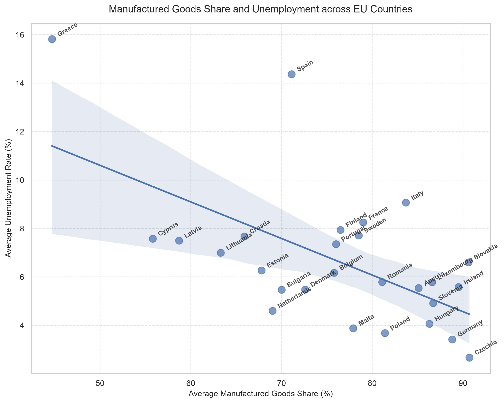
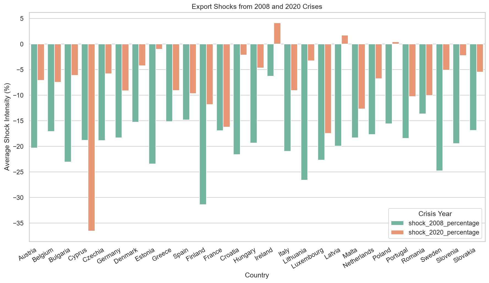
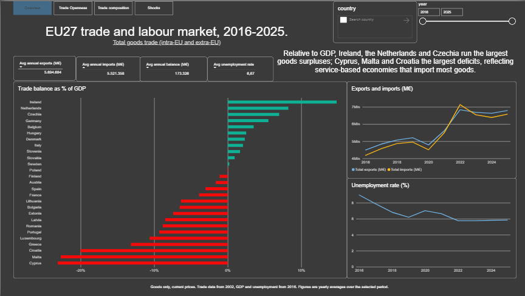
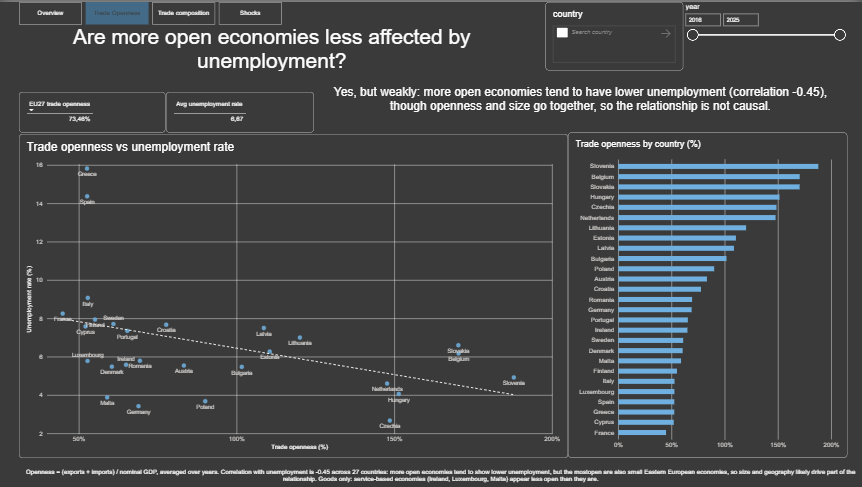
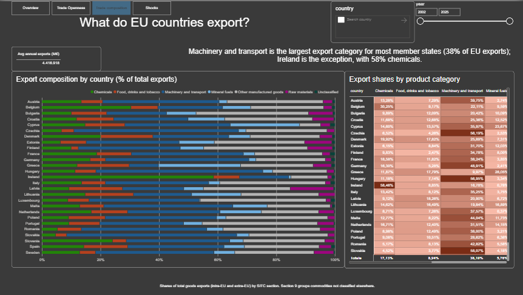
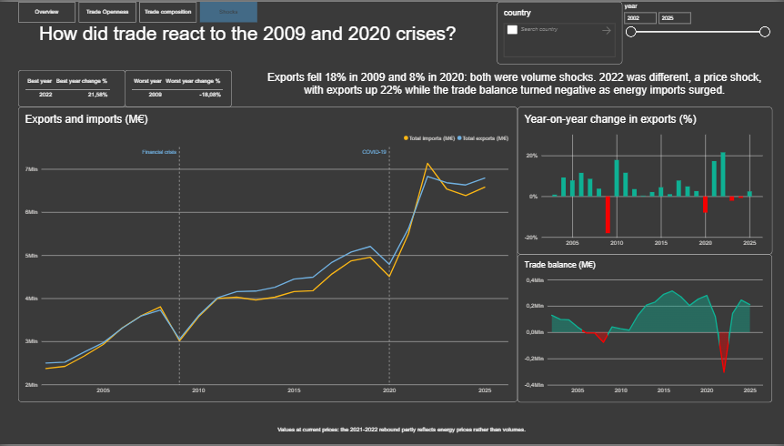

# EU Trade and Labour Market Analysis

An end-to-end data analysis project exploring the relationship between international trade and unemployment across the 27 EU countries, using raw Eurostat data (2002–2025). The project covers the full pipeline: raw data cleaning in pandas, loading into a relational database, SQL-based exploration and analysis, and an interactive Power BI dashboard built on SQL Server.

## Data Source

All raw datasets (trade, GDP, unemployment) were retrieved from the official Eurostat Data Browser:

| Dataset | Eurostat code | Coverage |
| --- | --- | --- |
| GDP and main components | `nama_10_gdp` | 27 countries, 2016–2025, current prices and chain linked volumes |
| Unemployment rate, annual | `une_rt_a` | 27 countries, 2016–2025, ages 15–74 |
| Intra and Extra-EU trade by Member State and product group | `ext_lt_intratrd` | 27 countries, 2002–2025, SITC sections |

### Scope of the trade data

- **Goods only.** Services are not covered. This matters when reading country rankings: service-based economies (Ireland, Luxembourg, Malta) appear far less open than they are.
- **Partner: world.** Flows include both intra-EU and extra-EU trade.
- **Current prices.** Values are nominal, so part of the growth over time reflects prices rather than volumes. This is most visible in 2021–2022, when energy prices drove much of the increase.
- **Different periods.** Trade data starts in 2002, GDP and unemployment in 2016. Any analysis combining them is restricted to the common 2016–2025 window.

## Research Questions

1. **Trade openness** — Do countries with greater trade openness (exports + imports as a share of GDP) show different unemployment levels?
2. **Export composition** — Is the share of manufactured goods in a country's exports associated with different unemployment levels?
3. **Economic shocks** — How did trade and unemployment react to the 2008–2009 and 2020 crises, and which countries recovered fastest?

## Key Findings

**Trade volume matters weakly.** Trade openness shows a moderate negative correlation with unemployment (Pearson r = -0.41): more open economies tend to have lower unemployment, but the relationship is weak and dispersed, and likely confounded by country size and geography.

**Composition matters more than volume.** The share of manufactured goods correlates more strongly with unemployment (r = -0.60, robust under Spearman ρ = -0.48) than trade openness does, suggesting that *what* a country exports is a better predictor of employment than *how much* it trades. The two metrics are largely independent (r = +0.22).



**Crises differ in nature.** The 2008–2009 financial crisis was deeper (average export shock -19.11%, imports -24.40%) with slow, multi-speed recovery, while the 2020 pandemic was milder (-6.98%) with rapid recovery: most countries returned to pre-crisis levels by 2021. In 2020, trade and unemployment were largely disconnected, as the shock hit services and lockdowns rather than merchandise trade, so the countries with the sharpest export collapse (e.g. Cyprus) were not those with the largest unemployment rise.



## Interactive Dashboard

`powerbi/ue_market_analysis.pbix` reads the cleaned tables from SQL Server and turns the same questions into an explorable report. Five pages, each answering one question:

| Page | Question | Main visual |
| --- | --- | --- |
| Overview | Who runs surpluses and deficits? | Trade balance as % of GDP by country |
| Trade openness | Are more open economies less affected by unemployment? | Openness vs unemployment scatter with trend line |
| Trade composition | What do EU countries export? | 100% stacked bars by SITC section |
| Shocks | How did trade react to the 2009 and 2020 crises? | Trade over time with crisis markers, year-on-year change |
| Country detail | (drill-through) | Country profile reached by right-clicking any country |





The data model is a star schema: two dimension tables (`dim_country`, `dim_year`) filter five fact tables through one-to-many relationships, so filters propagate consistently and fact tables are never joined directly. All calculations are DAX measures with their filters built in, which prevents the two most common errors in this dataset: summing nominal and real GDP together, and summing exports, imports and balance in the same total.





## Methodological Choices

- **Trade openness** was computed as (exports + imports) / GDP using *nominal* values for both, ensuring price-basis consistency. The result holds under real GDP as well (r = -0.41 nominal vs -0.45 real), confirming robustness to the definition.
- **Outlier handling.** Greece and Spain are structural outliers with high unemployment. To avoid distortion, both mean and median were reported, and Pearson and Spearman correlations were compared as a robustness check.
- **Shock measurement.** A *peak-to-trough* method was used, measuring the drop from the pre-crisis peak to the post-crisis minimum, with recovery defined as the return to pre-crisis levels. This method's limitations on series with strong pre-existing trends (e.g. Italian and French unemployment, already declining before 2020) were identified through rolling-window analysis and documented.
- **Aggregation method.** SQL computes openness as the average of yearly ratios; the DAX measure `Trade openness % (avg of years)` replicates this, while a simpler ratio-of-sums measure would weight high-volume years more heavily. The two differ by a few points and the choice is stated rather than implicit.
- **Series breaks.** Eurostat flags 21 country-year observations where the unemployment series is not fully comparable with previous years. These are kept in a separate table rather than silently ignored.
- **Rounding.** Aggregated trade balances differ from the Eurostat `balance` figure by a negligible amount, due to rounding accumulated over hundreds of values.

## Tech Stack

Python · pandas · SQLite · SQL Server Express · SQL / T-SQL · Power BI · DAX · matplotlib / seaborn · scipy

## How to Reproduce

### 1. Dependencies

```bash
pip install -r requirements.txt
```

Two components are not Python packages and must be installed separately for the Power BI part: **SQL Server Express** and the **ODBC Driver 18 for SQL Server**.

### 2. Analysis pipeline

Run the notebooks in order:

1. **`01-pre_exploration.ipynb`** (root) — processes and pre-cleans the raw Eurostat text data.
2. **`02-diagnostic_exploration/`** — the three diagnostic notebooks complete data verification, write the cleaned files to `data/clean_data/` and build the SQLite database (`database/ue_market.db`, not versioned: it is regenerated here).
3. **`03-descriptive_analysis/`** — baseline schema checks, dimensions and measures (`01`, `02`, `03`).
4. **`04-research_questions/`** — one notebook per question; generates the analytical tables and charts.

### 3. Dashboard pipeline

5. In SSMS, create the database: `CREATE DATABASE eu_trade;`
6. **`load_to_sql.ipynb`** (root) — loads the five cleaned CSVs into SQL Server, one table per file, and verifies the row counts.
7. Open `powerbi/ue_market_analysis.pbix` and refresh. If the server name differs from `.\SQLEXPRESS`, update it under Transform data, Data source settings.

## Repository Structure

- **`01-pre_exploration.ipynb`** — initial exploration and pre-cleaning of the raw dataframes.
- **`02-diagnostic_exploration/`** — full diagnostic and cleaning phase, writing to `data/clean_data/` and to the SQLite database:
  - `unemployment_diagnostic_exploration.ipynb`
  - `gdp_diagnostic_exploration.ipynb`
  - `InEx_Eu_trade_diagnostic_exploration.ipynb`
- **`03-descriptive_analysis/`** — pre-question database exploration: load checks, dataframe dimensions, temporal limits, measures by category and dimension.
- **`04-research_questions/`** — one notebook per research question. The first two are primarily SQL-based; the third uses pandas across a broader range of analyses.
- **`load_to_sql.ipynb`** — loads the cleaned CSVs into SQL Server with row-count verification.
- **`powerbi/`** — the Power BI report (`ue_market_analysis.pbix`).
- **`data/`** — all data, from raw to clean, plus charts:
  - `raw_data/` — original Eurostat files (.csv, .tsv)
  - `semi-processed_data/` — intermediate melted files (not yet SQL-ready)
  - `clean_data/` — cleaned, database-ready datasets (generated by step 2)
  - `charts/` — saved visualisations
- **`questions.md`** — the research questions.
- **`requirements.txt`** — core Python dependencies.

The SQLite database is generated by the notebooks and is not versioned.

## Limitations

- Correlations across 27 countries describe associations, not causal effects. Country size, geographic position and industrial history plausibly drive both openness and labour market outcomes.
- Goods trade only; a service-heavy economy is understated by construction.
- Nominal values throughout the trade series, so price and volume effects are not separated.
- GDP and unemployment cover 2016–2025 only, which limits the 2008–2009 analysis to trade data.

## Conclusion

The analysis suggests that EU27 employment dynamics are associated more with the structural composition of exports than with overall trade volumes, and that trade shocks and labour market outcomes can move independently: in 2020 the countries with the sharpest export collapse were not those with the largest rise in unemployment. These are associations observed on a small cross-section, and they are best read as a starting point for further work rather than as established causal findings.

*Matteo Papucci — 07/2026*
